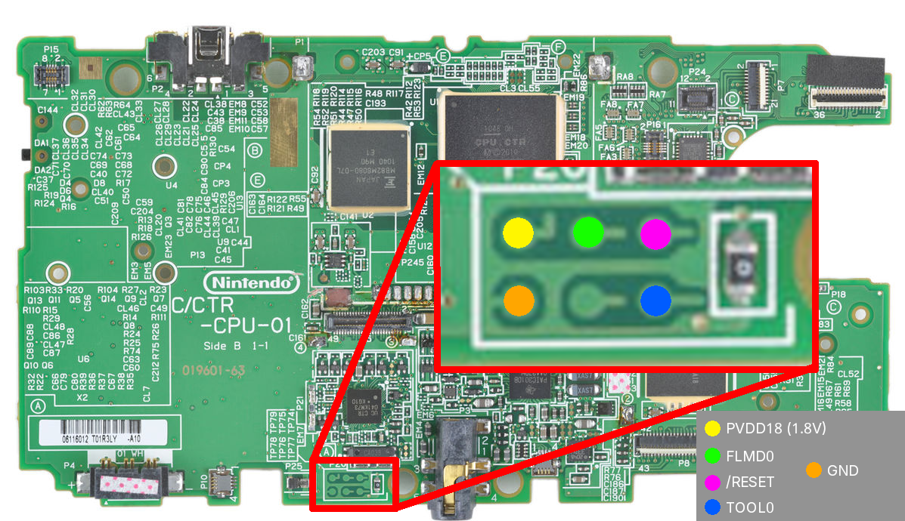
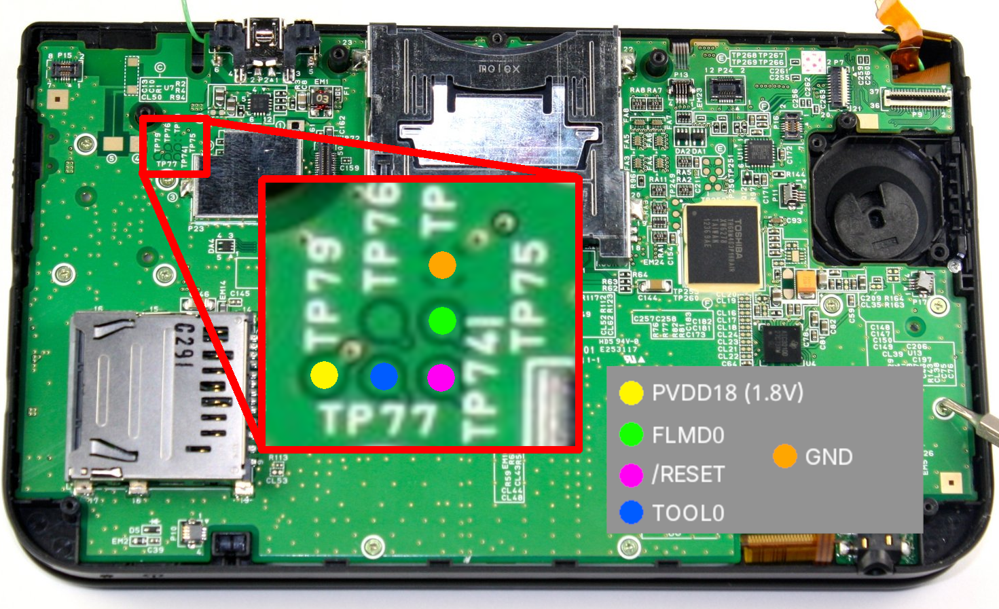
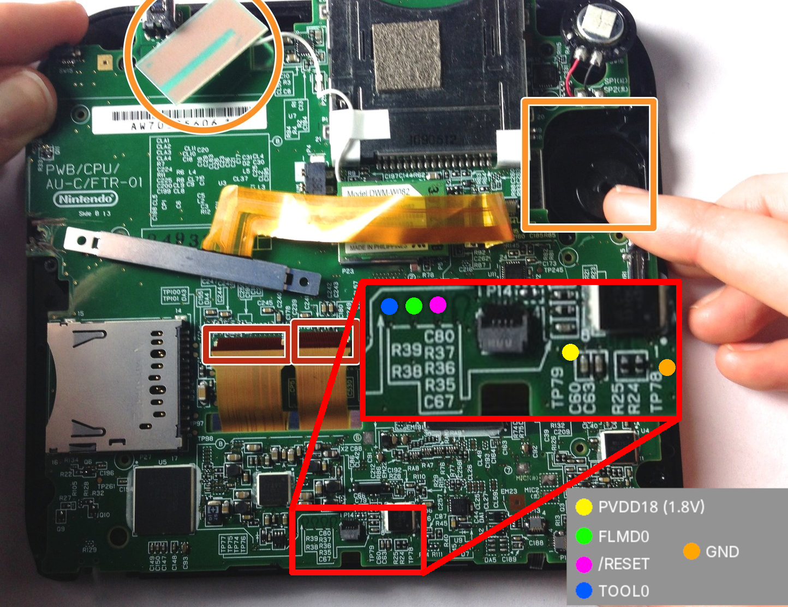
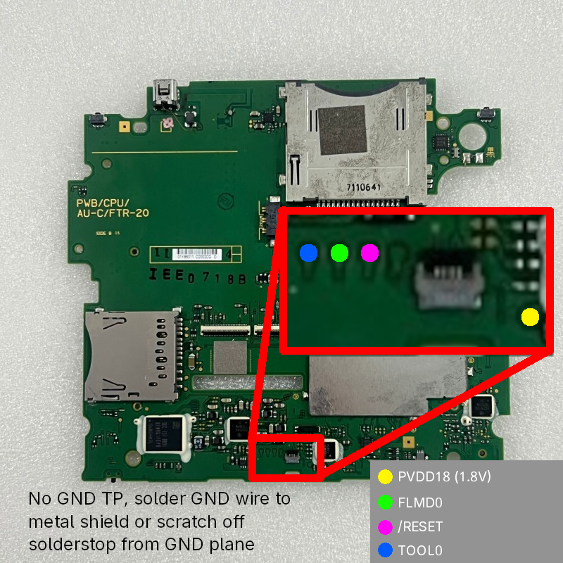
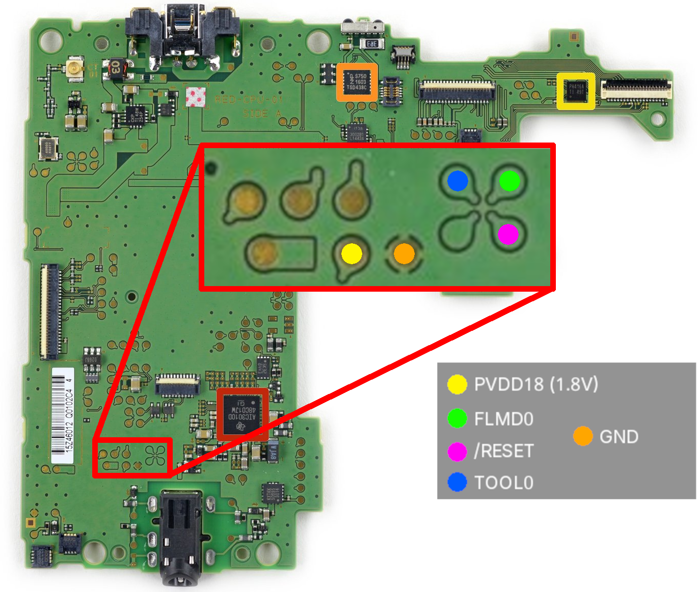
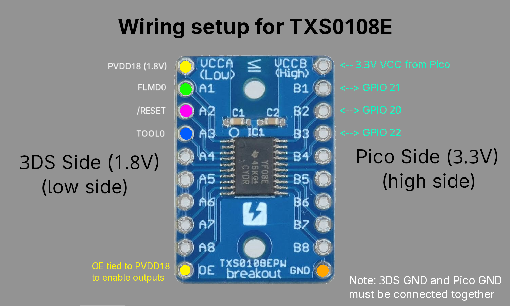

# µ-CTRFlash

A tool to externally (re)flash the MCU firmware of the 2DS/3DS family of systems using a Raspberry Pi Pico (RP2040).

It can be used in case of MCU bricks due to failed firmware upgrades (rare), or for flashing custom-made firmwares for research purposes.

## What you need

- A console from the Nintendo 2DS/3DS family of systems

- A Raspberry Pi Pico (RP2040)

- A bidirectional voltage level shifter capable of shifting from 3.3 V (Pi Pico I/O voltage) to 1.8 V (3DS MCU I/O voltage) supporting open-drain driving

- Microsoldering equipment: soldering iron with small enough tip, flux, copper wire (preferably enameled), PCB grinding pen (or a sharp blade)

- (Optional) A multimeter to check your wiring

## Getting started

> [!CAUTION]
> I assume no responsibility for bricked consoles or hardware damage. Every procedure is done at your own risk.

### 1. Preparing the console

The console needs to be disassembled to the point where the relevant pads are visible. (I'm not going to go over the details for that here, disassembly guides can be found on iFixit or elsewhere). If possible, take out the board completely so you have more space to work with.

> [!WARNING]
> Be careful when uncovering the pads! They are quite small, and applying too much force could lead to damage. When using a blade to scratch off the solderstop, take care not to accidentally cut the small traces leading to each pad.

1. Uncover the relevant pads. The pads are covered with solderstop and must be revealed using a grinding pen or a sharp blade.

	Pad location per console model:

	<details>
		<summary>Pinout: Old 3DS (click to expand)</summary>
		
	</details>

	<details>
		<summary>Pinout: Old 3DS XL (click to expand)</summary>
		
	</details>

	<details>
		<summary>Pinout: Old 2DS (FTR-01) (click to expand)</summary>
		
	</details>

	<details>
		<summary>Pinout: Old 2DS (FTR-20) (click to expand)</summary>
		
	</details>

	<details>
		<summary>Pinout: New 3DS XL (click to expand)</summary>
		
	</details>

	Currently unknown:
	- New Nintendo 3DS (non-XL)
	- New Nintendo 2DS XL


2. Solder wires to `PVDD18`, `FLMD0`, `/RESET`, and `TOOL0`.

	For `GND`, you can use either the `GND` point marked above (if applicable), solder to one of the metal shields, or scratch off some solderstop on the larger ground planes. (Preferably check that what you're soldering to is actually `GND` using a multimeter!)

3. Solder the wires from the console to the _low side_ of your level shifter, and connect the corresponding _high side_ to wires you can connect to your Pi Pico's GPIOs.

	By default, µ-CTRFlash is configured as follows:

	| Pad name       | GPIO on Pico  |
	| -------------- | ------------- |
	| `/RESET`       | GPIO 20       |
	| `FLMD0`        | GPIO 21       |
	| `TOOL0`        | GPIO 22       |

	As an example, I am going to use the [TXS0108E](https://www.ti.com/product/TXS0108E).

	In this case, connections are made as follows:

	

	Use `PVDD18` as the voltage source for the low-side of the shifter (1.8V), and your Pico's 3.3V supply (usually exposed as a pin on most dev boards) as the voltage source for the high-side of the shifter (3.3V).

	`GND` must be shared between the 3DS and Pico side, as mentioned above.

	Any other level shifter capable of shifting 1.8V-3.3V will work. Check the datasheet for your hardware of choice to determine the wiring setup.

### 2. Preparing the Pico

1. Clone the repository:
	```git clone https://github.com/ZeroSkill1/u-CTRFlash```

2. Install the [Raspberry Pi Pico C/C++ SDK](https://www.raspberrypi.com/documentation/microcontrollers/c_sdk.html#raspberry-pi-pico-cc-sdk).

3. Obtain the appropriate MCU firmware binary for your console model.

	MCU Firmware binaries can be found embedded inside the code binary of the `mcu` system module, namely:

	Name the firmware binary (should be exactly 16384 bytes) `mcu_firmware.bin` and place it inside the project directory (where `CMakeLists.txt` is located).

	SHA-256 for latest official firmwares:
	- `0004013000001F02` (old 2DS/3DS) version 2.37: `b06862090904b570525c479931bdea69e85658934b9dfe445e877ce3417ab61f`
	- `0004013020001F02` (new 2DS/3DS) version 3.65: `9112c3bee53e9e38367ebc9808803268132d7d7c10230b7002389dd81d868dc2`

4. Build µ-CTRFlash:

	```
	cd u-CTRFlash
	mkdir build
	cmake -B build
	cmake --build build
	```

5. Flash the built `.uf2` in `build/` onto your Pi Pico.

### 3. Flashing the MCU

> [!CAUTION]
> Make sure you used the correct firmware binary when compiling the program. Failure to do so will leave your console unbootable until you flash the correct firmware!

1. Ensure the MCU has power by either connecting the console battery (using something to hold it in place while the shell is removed), or by connecting the charger.

2. Connect the Pico to your computer and connect to the serial console.

	For example, using `screen`:

	```
	screen /dev/ttyACM0
	```

	Depending on your OS / Pico board the device path might differ.

	You should begin seeing output, beginning with the MCU device information.
	Example device info output from original 3DS (non-XL):

	```
	init common 06
	vendor: 10
	macro extension: EF
	macro function code: 04
	device extension code: DC FD FD
	internal flash last addr: FF7F00
	device name: D79F0104
	security flag info: FF
	boot block number: 03
	flash shield window start: 0000
	flash shield window end: 001F
	version data:
	dv: 00 00 00
	fw: 01 00 00
	```

	If you don't see this output or see an error code, check your wiring, and try again.

	µ-CTRFlash will immediately begin flashing the firmware binary. If your Pico has an LED, it will start blinking to indicate that the process is ongoing, and progress updates are shown in the serial output:

	```
	erased block 0000-0FFF successfully
	  prgm 0xf00 st=06 06 fin=t
	flashed block 0000-0FFF successfully
	  verify blk 0xf00... (final: Y) res: 0xf00 6 6
	verified flashed block 0000-0FFF successfully
	erased block 2000-2FFF successfully
	  prgm 0xf00 st=06 06 fin=t
	flashed block 2000-2FFF successfully
	  verify blk 0x2f00... (final: Y) res: 0x2f00 6 6
	verified flashed block 2000-2FFF successfully
	erased block 3000-3FFF successfully
	  prgm 0xf00 st=06 06 fin=t
	flashed block 3000-3FFF successfully
	  verify blk 0x3f00... (final: Y) res: 0x3f00 6 6
	verified flashed block 3000-3FFF successfully
	erased block 4000-4FFF successfully
	  prgm 0xf00 st=06 06 fin=t
	flashed block 4000-4FFF successfully
	  verify blk 0x4f00... (final: Y) res: 0x4f00 6 6
	verified flashed block 4000-4FFF successfully
	```

	If flashing fails for any reason, it will be shown in the output, and the LED (if applicable) will turn off.

	When flashing is completed successfully, the LED (if applicable) will stay on and the following will be shown:
	```
	the MCU firmware has been successfully flashed.
	```

	At this point, it is safe to disconnect the Pico. Also disconnect the battery and/or charger and let the system be unpowered for ~5 seconds.

	Then, reconnect the battery. The system should now function as normal.

## License

µ-CTRFlash is licensed under the GNU General Public License v3.0 (GPLv3).

This project includes modified code from [tool78](./tool78) by PoroCYon, which is also licensed under GPLv3. Modifications are documented in the source.

See the [LICENSE](./LICENSE) file for the full license text.

